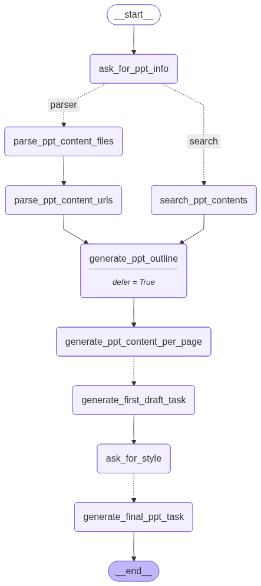
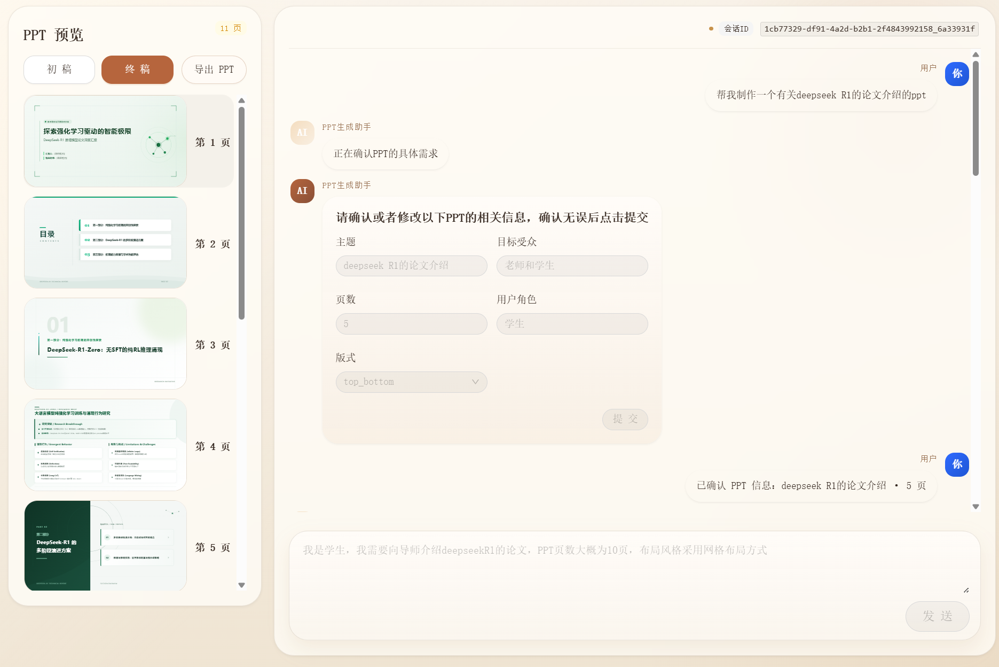

# 项目简介

该项目是一个PPT生成的Agent，用户输入PPT需求后，Agent通过Human-In—The-Loop的方式，分步骤地与用户交互，逐步补齐信息。之后根据用户PPT的需求信息来搜索PPT的内容，生成PPT的大纲，根据大纲生成每一页PPT的内容摘要，再生成ppt的初稿，最后生成终稿。本项目采用的是生成svg的方式，导出ppt之后可以在PowerPoint中转换为图形之后进行编辑

# 整体结构

```text
ppt-agent/
├── src/
│   ├── backend/           # FastAPI 接口层
│   ├── frontend/          # React 前端
│   └── ppt_agent/         # LangGraph Agent 与核心逻辑
├── user_data/             # 会话数据、上传文件、生成结果
├── pyproject.toml         # Python 依赖
├── uv.lock                
└── README.md
```

前端采用React + Ant Design X来构建用户界面,支持导出PPT，PPT的预览等功能；后端采用FastAPI来构建后端接口；Agent采用了`Langgraph`构建

> 前端代码采用的是vibecoding的方式进行开发，后端和agent代码都是自己写的

# 整体功能

1. PPT的生成: Agent根据用户输入的需求生成svg，最后将svg转换为ppt导出
2. PPT的预览和导出: 支持预览生成的PPT，并导出为PPTX文件，并且用户可以在PowerPoint中将svg转换为图形来进行编辑
3. 自动根据PPT的主题等信息搜索PPT的内容资料
4. 同时支持用户上传PPT的内容资料来作为PPT的内容来源
5. 暂停/继续: 在PPT生成过程中，用户可以选择暂停生成，此时Agent会停止当前的生成任务，等待用户继续。当用户选择继续时，Agent会从上次暂停的地方继续生成PPT。
6. 专门内置了一个用于ppt修改的agent，可以在生成ppt之后对ppt进行修改


# Agent特色
 
1. 生成初稿、终稿等操作采用并发执行尽量缩短时间，对于LLM调用等容易失败的操作，采取了重试的方式来尽量保证Agent顺利执行
2. 结果缓存复用：对部分高成本节点启用缓存，相同输入在不同会话中可直接复用结果，减少重复生成开销。
3. 可中断、可恢复：生成过程中支持手动取消，之后可从最近一次 checkpoint 继续执行，避免整条流程从头重跑。
4. 同时支持`tavily` 和 `firecrawl` 来抓取网页内容。
5. 使用`mineru`对用户上传的文档内容进行解析
6. 同时支持多种PPT的布局方式，目前支持卡片布局、上下布局



# 效果预览

生成的ppt在`generated_ppt`目录下
# 快速开始

## 依赖安装
1. 安装python依赖 (需要 [uv](https://docs.astral.sh/uv/) ):

```shell
uv sync 
```
2. 安装前端依赖

```shell
cd src/frontend
pnpm install
```


## 启动

### 启动后端
1. 配置环境变量
`cp .env.example .env`，并且补齐环境变量

2. 启动后端

```bash
python -m uvicorn src.backend.main:app --port 8000 --host 0.0.0.0
```  

### 启动前端
`cp src/frontend/.env.example  src/frontend/.env`,并编辑环境变量设置接口的`base_url`

```bash
pnpm --dir src/frontend/ dev --host --port 5173

```

# TODO_List
- [ ] URL的检验
- [ ] speaker_note的生成
- [ ] 封面页等考虑采用一种统一的布局方式，例如居中并且采用从上到下，从左到右的布局方式
- [ ] 支持docker部署
## 参考与致谢

- [应该是目前最强的PPT Agent，附上完整思路分享](https://linux.do/t/topic/1782304)
- [【使用外部知识降低模型幻觉】让专业的grok干专业的search，让专业的tavily干专业的crawl](https://linux.do/t/topic/1606525)
- [ppt-master](https://github.com/hugohe3/ppt-master)

## License

[GPL-3](./LICENSE)
